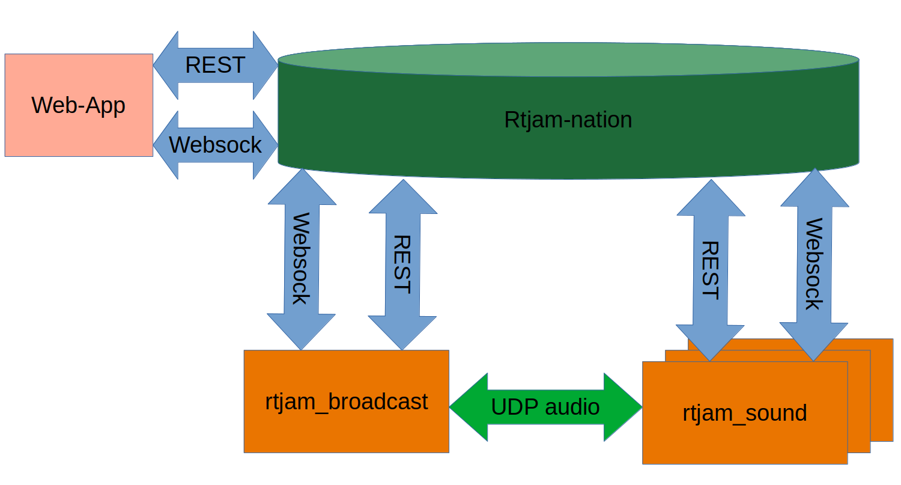

# RTJam

Real Time Music Jam

So cool!

The Real Time Music Jam software is intended to provide low latency audio over the internet that will enable performers to make music as if they were in the same place. The system is comprised of a broadcast server that listens on a UDP port for jam packets and some number of clients that create/consume audio data.

The server keeps a table of jammers in the "room" and will forward each packet it receives to the other jammers in the room. It does not transmit the audio data back to the orginator (client provides local monitoring).

Each jam packet has two separate channels of audio so the jammers can have a channel for voice and guitar, stereo keyboards, or whatever they choose. The two channels are isochronous for that person.

So in this way a room consists of jammers each with two channels.

## Get The code

```
git clone https://github.com/mfvargo/rtjam_rust.git
cd rtjam_rust
make
```

The Makefile just calls cargo build for the two example programs.

## Components

### rtjam_rust library

This is the library of all the components used to make the rtjam_sound and rtjam_broadcast executables.

## Examples

Note that the software runs well on the Raspberry Pi4 aarch64 OS. If you want want info on installing on that platform (pretty much generic debian), you can read more
[`here`](docs/Pi%2064bit%20aarch64%20setup.md)

### Jack Standalone (examples/rtjam_sound.rs)

The RTJam software also builds on the Raspberry Pi 4 and can be run as a "standalone JACK" application. This has been the most successful implementation for playing music realtime on the internet. The Pi has a very stable multimedia jack port that can run 64 sample frames with only 2 period of buffer without the dreaded XRUN issues you see on most other platforms.

Although the pi is a good platform, the software will also run on Mac OSX and Windows as well as linux.
The requirements for this to run are that jackd2 is installed. The underlying hardware needs to support 128 sample/frame at 48000 Hz sample rate.

### Broadcast Server (examples/rtjam_broadcast.rs)

The server just listens for packets from rtjam clients. The server dynamically creates channels based on the source address of the client packets and forwards packets to all active listeners. There is currently no session control. When you start transmitting the server will allocate a channel to you if one is open. If you don't send any packets for 1 second, your channel is made available.

The server should run on any OS that has a std rust compiler.

## System Architecture



## Where is the U/X? Web-App

The rtjam_sound and rtjam_broadcast components are the audio pieces of the rtjam-nation project. This is hosted at rtjam-nation.com. The site provides the mechanism to coordinate all the rtjam_sound and rtjam_broadcast entities into a network. The U/X to manage the devices is hosted there.
It is written in React/NextJs and talks to the rtjam-nation api for user authentication, and component
management. It also uses websockets to communicate directly with the broadcast and sound components.

### rtjam-nation REST API

The rtjam-nation server provides a REST api that allows the sound and broadcast components to
register and indicate that they are operating. See the jam_nation_api module. Each component creates a thread to periodically ping the network indicating the component is operational.

### websocket interface

Once a component has registered with the jam_nation_api it then connects to the websocket server at rtjam-nation.com and creates a "room" that is named after the component's token which is
returned from the jam_nation_api. This websocket is used to communicate to u/x elements serverd
up by the rtjam-nation website. see the common::web_socket module.

#### rtjam_sound websocket

The sound component uses the websocket to provide real time json updates to the u/x regarding volume levels and room member info. The component also receives commands from the u/x via the websocket. This
is a "meet me in the middle" approach to allow communication between the web client and the sound
component. Typical commands are "join the room hosted here" or "turn the volume down on channel 0" or
"insert a TubeOverdrive pedal on channel 0". see the sound::param_message module.

More [`information`](docs/pedals.md) about Effects and the system.

#### rtjam_broadcast websocket

The room broadcast server uses the websocket to provide real time round trip latency measures to the
websocket room for the component. There are some future commands to be sent on the websocket
such as "start recording" and "stop recording". These functions were implemented in the original C++
version but have not been ported to the rust library yet.
