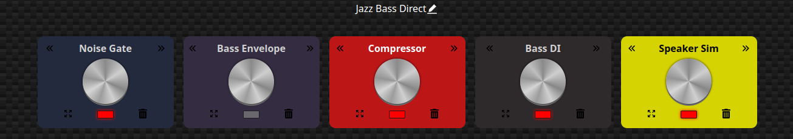
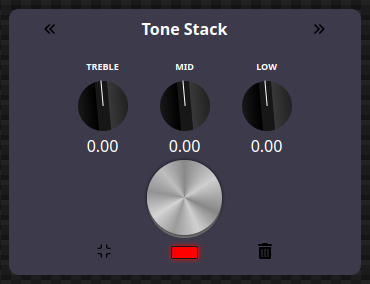

# Effects (aka Pedals)

One of the features of the rtjam_sound component is the support of pedal boards that can
be arranged by the users.The boards are composed of "Effects" or "Pedals" that can be
cascaded. Audio from the sound device is routed through the PedalBoard and then
sent along to the network (and the local monitoring channel for the user).

## What is an Effect

An Effect is a Rust Structure that implements the Pedal trait. This trait give the top
down view from the PedalBoard to the Effect that allows it to be constructed, modified, serialized, and called on to process audio.

## What is a PedalBoard

A pedalboard is just a container of Effects. It allows a whole set of Effects to be constructed
from a saved set of json. The PedalBoard supplies the API that allows individual Effects to be
modified (turn the knobs), moved (change the order of Effects in the chain), etc.

## How are they stored?

A PedalBoard has a function to serialize itself into json.  
That json is stored and retrieved from the rtjam-nation service. The json contains an array
of effects called "config". Each entry in this array corresponds to an individual effect.
Each Effect defines what it's json means but it consists of an array settings that the
Effect applies to make it operate. The Effect also supplies the "algorithm" that is applied
to audio frames.

Each setting also has a specific "name". This name is used by the PedalBoard to manufacture an Effect of that type. So as new Effects are added, the PedalBoard make_pedal() function will be
enlarged to make those new Effects. As long as those Effects implement the Pedal trait, the
PedalBoard will be able to use them.

## Sample Board 1 - Jazz Bass Direct

This is a sample board as displayed through the rtjam-nation u/x. It is stored in the cloud and
has the json as described [`here`](jazz_bass_direct.json)

It consists of 5 Effects and they are applied from left to right on the signal.

## Sample Board 2 - ToneStack only

This is a PedalBoard with only one pedal. The json for this board can be seed [`here`](tonestack_only.json)

The u/x exposes the "settings" for effects. This is the Tone Stack Effect expanded

The settings can be manipulated via the u/x. This are converted to messages that are interpreted
by the JamEngine and eventually modify the Effects indivual settings.
